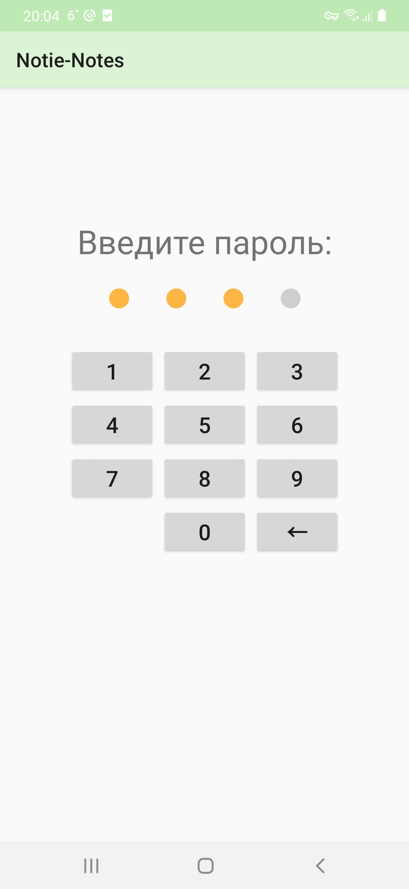
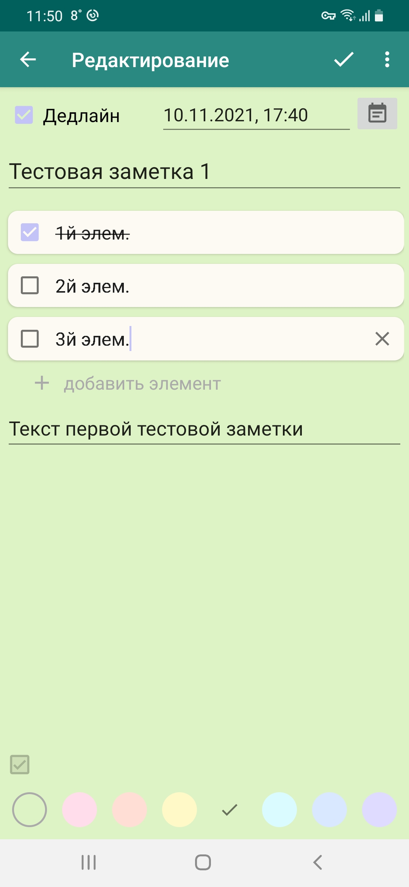

# Notie-Notes

This is a simple Android app for creating notes.

## Features:
* adding a deadline to a note;
* adding a task list to a note;
* colored backgrounds for notes;
* ability to share a note;
* sorting notes;
* search by notes;
* enabling / disabling the password;
* fingerprint authentication;
* dark and light modes;
* multiple color themes;
* Russian and English languages.

## Screenshots:
 